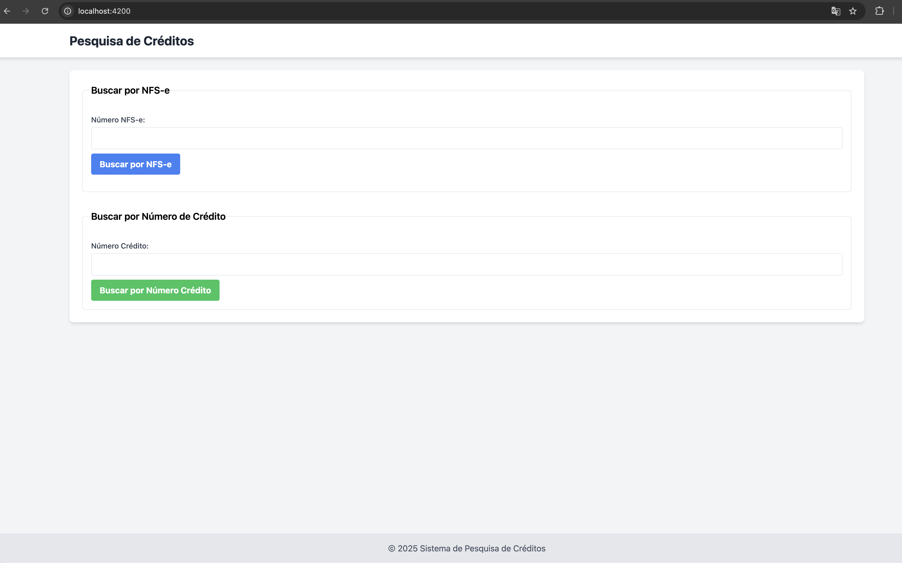
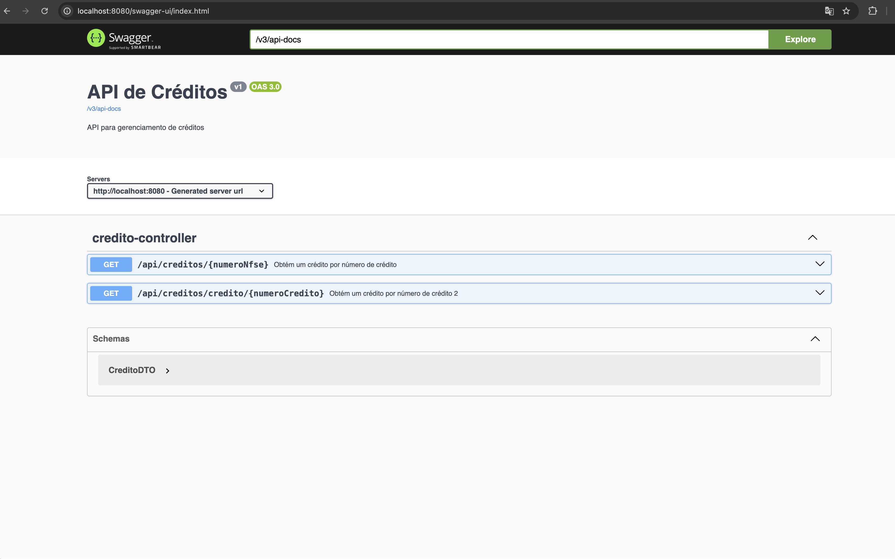

# creditos_constituidos

### Pré-requisitos

* Certifique-se de que o Docker esteja instalado em sua máquina.
* Certifique-se de que o Node.js versão 22 esteja instalado em sua máquina.

### Clonagem do Projeto

1.  Clone o repositório do projeto para sua máquina local:

    ```bash
    git clone https://github.com/edutav/creditos_constituidos.git
    ```

### Execução do Projeto

1.  Navegue até o diretório do projeto:

    ```bash
    cd creditos_constituidos
    ```

2.  Execute o seguinte comando para construir e iniciar os serviços do Docker:

    ```bash
    docker compose up -d --build
    ```

    Este comando irá construir as imagens Docker necessárias e iniciar os seguintes serviços:

    * Banco de dados (PostgreSQL)
    * ZooKeeper
    * Kafka
    * Backend (API)

Com isso, os serviços essenciais para o funcionamento do projeto estarão em execução.

### Configuração do Frontend

1.  Navegue até o diretório `app`:

    ```bash
    cd app
    ```

2.  Execute o seguinte comando para instalar as dependências do frontend:

    ```bash
    npm run ci
    ```

3. Execute o seguinte comando para iniciar o frontend:
    ```bash
    npm run start
    ```
4.  A aplicação estará disponível em [http://localhost:4200](http://localhost:420)    

### Captura de Tela da Aplicação
### Frontend


### Backend
